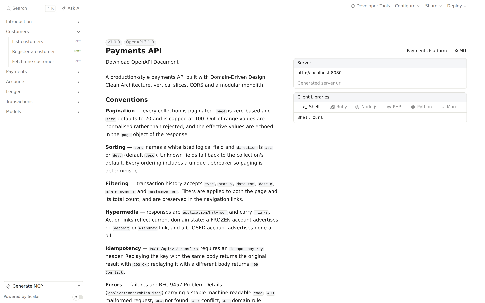
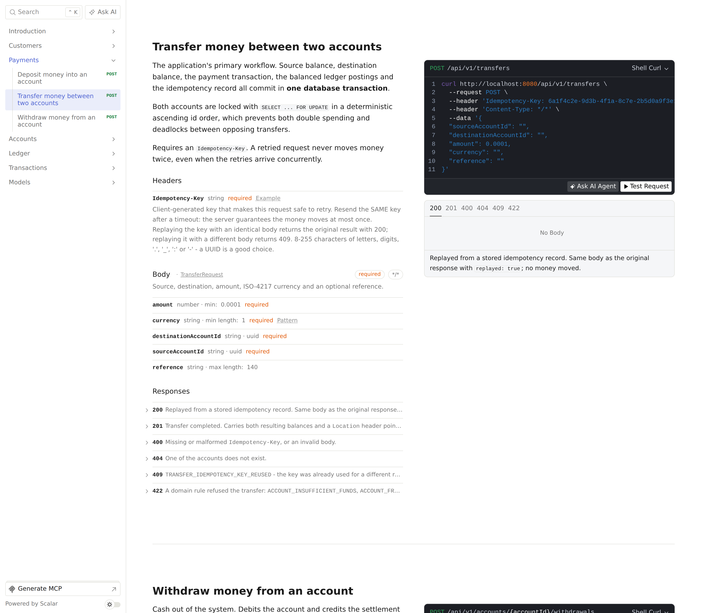
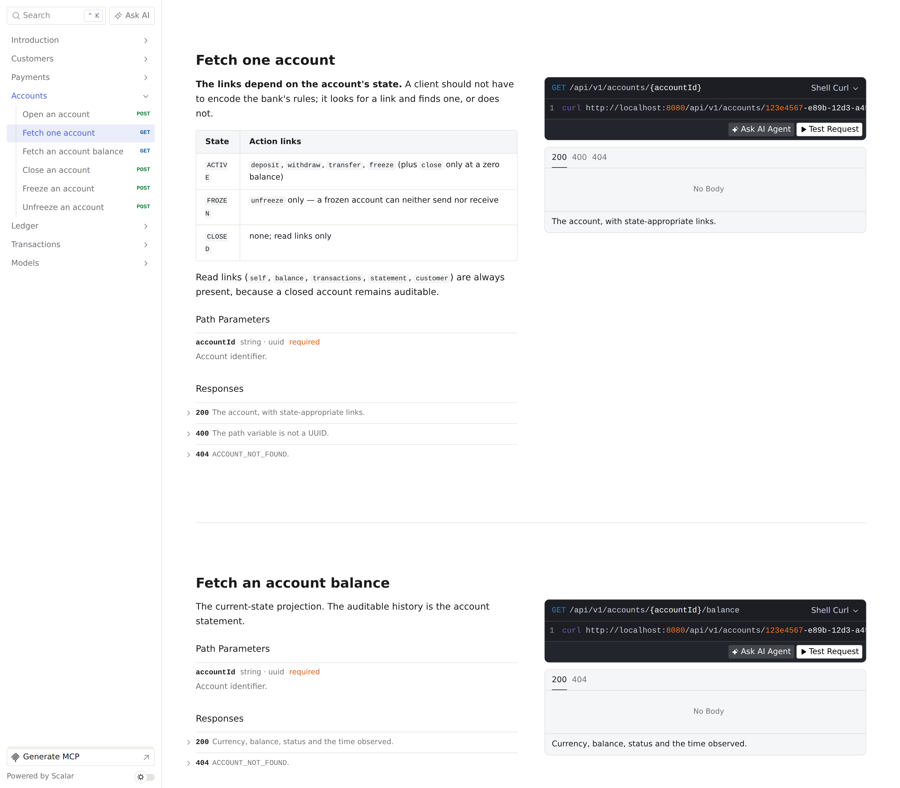
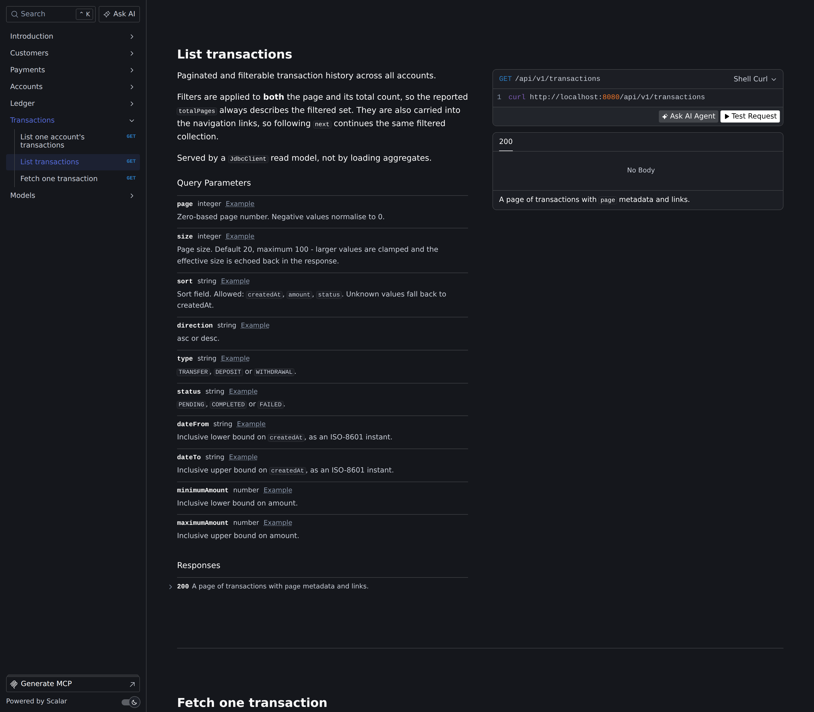

# Payments API — a .NET developer's guide to modern Java/Spring

A production-style payments API built with Domain-Driven Design, Clean Architecture, vertical slices,
CQRS and a modular monolith — written to teach an experienced .NET developer how the architecture they
already know maps onto Java 25 and Spring Boot 4.

It is deliberately **not** a Controller → Service → Repository → Entity CRUD application.

```
Java 25 (LTS) · Spring Boot 4.1.1 · Spring Framework 7 · Hibernate 7.4 · PostgreSQL 18
Spring Modulith 2.1 · Spring HATEOAS 3.1 · Flyway 12 · JUnit 6 · Testcontainers 2
```

**183 tests**: 121 unit (no Spring), 62 integration (real PostgreSQL).

---

## The build is the architecture

Five Maven modules, one per Clean Architecture layer — the direct equivalent of separate `.csproj`
projects in a .NET solution:

```
payments-parent  (pom)
├── payments-domain           ── no framework on its classpath at all
├── payments-application      ── depends on domain
├── payments-infrastructure   ── depends on application
├── payments-api              ── depends on application
└── payments-bootstrap        ── depends on all four; the only runnable jar
```

This exists for one reason: **the dependency rule is enforced by the compiler, not by a test.**
`payments-domain`'s POM has no Spring, no Hibernate, no Jackson, no servlet API. So
`import org.springframework...` inside an aggregate does not "break a rule" — it does not resolve.

Check it rather than trusting it:

```console
$ ./mvnw -pl payments-domain dependency:build-classpath
jspecify-1.0.1.jar
spring-modulith-api-2.1.1.jar     ← annotations only, provided scope
junit-jupiter-6.0.3.jar           ← test
assertj-core-3.27.7.jar           ← test
```

That is the whole compile classpath of the domain layer. `spring-modulith-api` is there solely for the
`@ApplicationModule` annotations that declare the bounded-context graph; its only mandatory transitive
dependency is `jspecify`, because `spring-context`, `spring-tx` and `spring-boot-autoconfigure` are all
declared `<optional>` upstream.

`payments-api` and `payments-infrastructure` do not appear in each other's POMs, so an endpoint cannot
import a JPA entity and a repository cannot import a resource assembler — both are build failures, not
review comments. `LayerModuleIsolationTest` asserts each of these properties so the POMs cannot quietly
drift.

**Layers are Maven modules; bounded contexts are packages.** The two axes are orthogonal and both are
verified:

| Axis | Mechanism | Enforced by |
|---|---|---|
| Layers (domain / application / infrastructure / api) | Maven modules | the compiler, then ArchUnit |
| Bounded contexts (customers / accounts / ledger / payments) | packages within each module | Spring Modulith |

So `accounts` exists in four modules — `payments-domain/…/accounts/domain/`,
`payments-application/…/accounts/application/`, and so on — with package names unchanged. Spring
Modulith reads the runtime classpath, so it still sees `accounts` as one module and still fails the build
on a cross-context reach-in or a cycle.

### What this costs

Honest trade-offs, not free wins:

- **A vertical slice is split across two modules.** `payments/transfer/application` lives in
  `payments-application` and `payments/transfer/api` in `payments-api`. The package names still read as
  one slice, but the files are no longer adjacent on disk. .NET makes the same trade with feature folders
  inside each project.
- **`-am -pl` is now required** to build or run one module (see above).
- **Five POMs to maintain** instead of one, and a new dependency has to be placed deliberately rather
  than added to a single list. That deliberation is the point, but it is friction.

For a smaller service, one module with ArchUnit-enforced packages is a perfectly reasonable choice — and
was the previous shape of this repository. The multi-module split earns its keep once "the domain must
not depend on the framework" needs to be a guarantee rather than an agreement.

---

## Quick start

```bash
docker compose up -d                                                    # PostgreSQL only
./mvnw -am -pl payments-bootstrap spring-boot:run \
       -Dspring-boot.run.profiles=local                                 # seeds a demo dataset
```

Then open **<http://localhost:8080/docs>** — the Scalar API reference, served offline from the jar.



<details>
<summary>More of the API reference</summary>

**The transfer endpoint** — the `Idempotency-Key` header, the request schema with its validation
constraints, and all six status codes it can return:



**State-driven hypermedia** — the account endpoint documents which links appear in which state, because a
client should look for a link rather than encode the bank's rules:



**Pagination, sorting and filters** on transaction history (dark theme):



</details>

```bash
./mvnw test                 # unit + architecture tests, no Docker needed
./mvnw verify               # everything, including Testcontainers integration tests

./mvnw -pl payments-domain dependency:tree   # see for yourself that the domain has no framework
```

<details>
<summary>Why <code>-am -pl</code>? (multi-module Maven for a .NET developer)</summary>

`-pl payments-bootstrap` means "only this module" — the Maven equivalent of building one `.csproj`.
`-am` means **also make** the modules it depends on. Without `-am`, Maven looks for
`payments-api-1.0.0-SNAPSHOT.jar` in your local repository, doesn't find it, and fails — it will not
infer that a sibling in the same build could produce it.

`dotnet build` resolves project references automatically; Maven does not, and this is the single most
common stumble when a .NET developer meets a multi-module reactor. Alternatively run `./mvnw install`
once and plain `-pl` works from then on.
</details>

Requires **JDK 25** and Docker. The whole stack runs locally: no cloud, no broker, no cache, no external
service.

<details>
<summary>Try the primary workflow</summary>

```bash
# List seeded customers
curl -s localhost:8080/api/v1/customers | jq

# An account, with links that reflect its current state
curl -s localhost:8080/api/v1/accounts/{id} | jq '._links | keys'

# Transfer money — the Idempotency-Key is required
curl -s -X POST localhost:8080/api/v1/transfers \
  -H 'Content-Type: application/json' \
  -H "Idempotency-Key: $(uuidgen)" \
  -d '{"sourceAccountId":"…","destinationAccountId":"…",
       "amount":250.00,"currency":"USD","reference":"Rent payment"}' | jq

# Send the same request twice with the same key: 200, replayed, money moves once
# Send it with a different body:                 409 Conflict
```
</details>

---

## The map: .NET → Java/Spring

| .NET | Java / Spring | Notes |
|---|---|---|
| .NET 10 | **Java 25 (LTS)** | Records, sealed interfaces, pattern matching, virtual threads |
| ASP.NET Core Minimal APIs | **`RouterFunction` / `HandlerFunction`** | See below — including what it costs |
| `app.MapGet` / `app.MapPost` | `RouterFunctions.route().GET(…).POST(…)` | |
| `IServiceCollection` | `@Configuration` + `@Bean` | |
| Built-in DI container | **Spring IoC container** | Constructor injection throughout |
| Clean Architecture | Clean Architecture | Layers are **Maven modules**; the compiler enforces the dependency rule |
| `Company.Domain.csproj` etc. | `payments-domain` etc. (Maven modules) | Same idea, same guarantee |
| `dotnet build` resolves project refs | `./mvnw -am -pl <module>` | Maven needs `-am`; see the note above |
| Aggregate Root | Aggregate Root | `AggregateRoot<ID>` base class |
| Value Object | **Java `record`** | Immutable, structural equality, compact constructor validation |
| Domain Events | Domain Events + **Spring Modulith** | With a persistent outbox |
| Wolverine handler | **Typed `CommandHandler<C,R>` bean** | No mediator — endpoints inject the handler |
| `ErrorOr<T>` | **`sealed interface Result<T>`** | `Success` \| `Failure`, exhaustive `switch` |
| `Error.Validation()` / `.NotFound()` | `ErrorType.VALIDATION` / `.NOT_FOUND` | Domain classification, not HTTP |
| FluentValidation | **Jakarta Validation** (transport) + domain invariants | Deliberately separate — see below |
| EF Core | **Hibernate / JPA** | |
| `DbContext` | `EntityManager` + persistence context | |
| EF change tracking | **Hibernate dirty checking** | No explicit `save`; flush emits the `UPDATE` |
| Generic EF repository | `GenericHibernateRepository<E,ID>` | **Infrastructure only** |
| Dapper | **`JdbcClient`** | The read side |
| `DbContext.Database.BeginTransaction()` | `@Transactional` | Proxy-based — mind self-invocation |
| `ProblemDetails` | **`ProblemDetail`** (RFC 9457) | |
| ASP.NET HATEOAS library | **Spring HATEOAS** | `RepresentationModel`, `EntityModel`, `PagedModel` |
| `PagedResult<T>` | `PageResult<T>` + `PagedModel` | Spring Data's `Page` never escapes infrastructure |
| `appsettings.json` | `application.yml` | Profiles instead of environments |
| Serilog | **SLF4J + Logback** | Structured MDC: `traceId`, `spanId`, `correlationId` |
| OpenTelemetry | **Micrometer + OpenTelemetry** | Vendor-neutral |
| xUnit | **JUnit 6** | `@Test`, `@Nested`, `@ParameterizedTest` |
| NSubstitute | **Mockito** | `mock()`, `when()`, `verify()`, `InOrder` |
| FluentAssertions | **AssertJ** | `assertThat(x).isEqualTo(y)` |
| `WebApplicationFactory` | `@SpringBootTest(webEnvironment = RANDOM_PORT)` | |
| Testcontainers | **Testcontainers** | Same project |
| Swashbuckle / OpenAPI | **springdoc-openapi** | |
| Scalar | **Scalar** | Mounted by hand — see below |
| NetArchTest | **ArchUnit** | 22 rules |

---

## Spring concepts a .NET developer needs

### The IoC container and bean lifecycle

Spring's container is closer to `IServiceCollection` + `IServiceProvider` than to anything else, with one
big difference: **most registration is by classpath scanning, not explicit calls.**

| Annotation | Role | .NET analogue |
|---|---|---|
| `@Component` | Generic managed object | `services.AddScoped<T>()` |
| `@Service` | A component holding application logic | — |
| `@Repository` | A persistence component; also translates JDBC exceptions into Spring's `DataAccessException` hierarchy | — |
| `@Configuration` | A class declaring beans | A `ServiceCollection` extension method |
| `@Bean` | A factory method for one bean | `services.AddSingleton(sp => …)` |

Beans are **singletons by default** — not scoped-per-request as in ASP.NET Core. Anything request-scoped
must be passed as a parameter, which is one reason handlers here are stateless and take a `Clock`.

Lifecycle: instantiate → inject dependencies → `@PostConstruct` → in use → `@PreDestroy`.

Only constructor injection is used. Field injection (`@Autowired` on a field) makes dependencies
invisible, prevents `final`, and stops you constructing the class in a unit test — an ArchUnit rule
forbids it.

### Functional endpoints

The Minimal API equivalent, and the reason this codebase has no `@RestController`:

```csharp
// .NET
app.MapPost("/api/v1/transfers", TransferMoney);
```

```java
// Spring
@Bean
RouterFunction<ServerResponse> transferRouterFunction(TransferEndpoint endpoint) {
    return RouterFunctions.route()
            .POST("/api/v1/transfers", endpoint::transfer)
            .build();
}
```

- **`RouterFunction`** — a bean mapping requests to handlers. Spring composes every such bean.
- **`HandlerFunction`** — `ServerRequest → ServerResponse`. Here, a method reference.
- **`ServerRequest`** — `pathVariable()`, `param()`, `headers()`, `body(Class)`.
- **`ServerResponse`** — a builder: `ok()`, `created(uri)`, `status(…)`.

**What it costs.** Three things stop working, and they are rarely mentioned:

1. **`linkTo(methodOn(...))` is unavailable** — it reflects over an annotated controller method. Replaced
   by an `ApiPaths` constants class. Arguably safer: a renamed path breaks compilation instead of
   silently emitting a wrong link.
2. **`@Valid` does nothing** — Bean Validation is run by the annotated-controller argument resolvers, so
   nothing inspects the annotations. `RequestValidator` invokes it explicitly.
3. **springdoc generates no paths** — it discovers controllers by reflection, and a `RouterFunction` is an
   opaque runtime object. This one is a *silent* failure: the app runs, `/docs` returns 200, and the API
   reference is simply blank. The fix is `SpringdocRouteBuilder`, a drop-in replacement that takes an
   operation builder per route:

   ```java
   SpringdocRouteBuilder.route()
           .POST(ApiPaths.TRANSFERS, endpoint::transfer, ops -> ops
                   .operationId("transferMoney")
                   .summary("Transfer money between two accounts")
                   .parameter(OpenApiDocs.idempotencyKeyHeader())
                   .requestBody(requestBodyBuilder().implementation(TransferRequest.class))
                   .response(OpenApiDocs.hal("201", "Transfer completed."))
                   .response(OpenApiDocs.problem("422", "A domain rule refused the transfer.")))
           .build();
   ```

   Documentation lives in the same call as the route, so the two cannot drift — delete a route and its
   docs go with it. `OpenApiDocumentIT` then asserts that all 16 operations are present, so a route added
   with the wrong builder fails the build instead of quietly shrinking the docs.

All three are solvable, and all three are real. Choose functional routing because you want explicit
routing tables, not because you expect it to be free.

### Spring HATEOAS

| Type | Use |
|---|---|
| `RepresentationModel<T>` | Base class adding `_links` |
| `EntityModel<T>` | Wraps an existing object |
| `CollectionModel<T>` | An unpaged collection |
| `PagedModel<T>` | A collection plus `page` metadata and navigation links |

Resources here extend `RepresentationModel` and are built by dedicated assemblers, so link structure is
testable on its own.

### JPA, the persistence context and dirty checking

The `EntityManager` is the `DbContext`. Within a transaction it keeps a **persistence context** — a
first-level cache and identity map. An entity loaded there is *managed*, and Hibernate compares it
against its loaded state at flush time, emitting an `UPDATE` for what changed. **There is no `save` call
for an existing entity**, which surprises most EF Core developers arriving in Hibernate:

```java
Account account = repository.findById(id).orElseThrow();
account.credit(amount, now);
repository.save(account);   // copies state onto the managed entity; the UPDATE comes at flush
```

`open-in-view` is set to `false`. The default (`true`) keeps the persistence context open during
response rendering, which quietly turns a serialisation pass into a source of database queries.

### `@Transactional` and the proxy trap

Spring implements `@Transactional` with a proxy. Callers get the proxy; it starts the transaction and
delegates. So **a call from one method of a bean to another method of the same bean bypasses the proxy
entirely** and the annotation does nothing. It is one of the most common Spring bugs, and it is invisible
until something needs to roll back.

This codebase is shaped around it: `TransferMoneyHandler`, `TransferMoneyOperation` and
`TransferReplayReader` are three beans precisely so their transaction boundaries are real.

### `JdbcClient`

Spring 6.1+'s fluent JDBC API — the Dapper of this stack.

```java
jdbc.sql("SELECT id, balance FROM accounts WHERE id = :id")
    .param("id", accountId.value())
    .query((rs, i) -> new AccountBalance(rs.getObject("id", UUID.class), rs.getBigDecimal("balance")))
    .optional();
```

### Spring Modulith

Derives module structure from packages: each direct sub-package of the application package is a module,
its **root package is public**, everything beneath is **internal**. `ApplicationModules.verify()` then
fails the build on a cross-module reach-in or a dependency cycle.

### Java language features

**Records** — immutable data carriers with structural equality. Validate in the compact constructor:

```java
public record Money(BigDecimal amount, Currency currency) {
    public Money {                                    // compact constructor
        amount = amount.setScale(currency.getDefaultFractionDigits(), HALF_EVEN);
    }
}
```

**Sealed interfaces** — closed hierarchies, so `switch` is exhaustive without a `default`:

```java
return switch (result) {
    case Result.Success<T>(T value) -> onSuccess.apply(value);   // record pattern
    case Result.Failure<T> failure  -> onFailure.apply(failure.errors());
};
```

A `default` branch would silently swallow a new case; exhaustiveness makes adding one a compile error at
every site that must handle it.

---

## Where this design pushed back on the brief

Eight decisions differ from the specification. Each was forced by the compiler, the framework, or a
correctness bug found while running the thing.

### 1. `sealed interface DomainError` does not compile

The brief asked for `sealed interface DomainError permits AccountError, MoneyError, …`. The JLS requires
permitted subtypes to share a package (or a named JPMS module), and our errors live in separate bounded
contexts:

```
error: class DomainError in unnamed module cannot extend a sealed class in a different package
```

**Resolution:** a plain root interface; each module seals its own hierarchy. Exhaustiveness is preserved
where it is useful (inside a module) and the boundaries survive.

### 2. Accounts cannot open with a balance

`Account.open(…, initialDeposit)` produced an account whose balance no ledger posting explained. The
first end-to-end run showed it plainly:

```
account_balance | ledger_balance
       5000.0000 |         0.0000
       1000.0000 |         0.0000
```

For a system whose point is an auditable ledger, that is a defect. Accounts now open **empty** and are
funded by a deposit, which writes balanced postings. After the fix, every balance reconciles — and
`TransferIT` asserts it permanently.

### 3. Deposits and withdrawals live in Payments, not Accounts

They produce payment transactions and ledger postings. Owned by Accounts, `accounts → payments` would
close a cycle with the existing `payments → accounts`. The URL still reads
`/accounts/{id}/deposits`: **URL shape and module ownership are separate decisions.**

### 4. Ledger declares its own `PostingReference`

Importing `TransactionId` from Payments would create a cycle. The Ledger names the concept on its own
terms and Payments translates at the boundary.

### 5. Functional routes documented themselves as nothing

The first OpenAPI document had **zero paths**, so Scalar rendered an empty reference — and nothing
failed. Fixed with `SpringdocRouteBuilder` across all ten route classes, and locked down by
`OpenApiDocumentIT`, which asserts every operation, its `operationId`, summary, tag, responses and
request schema.

### 6. The Scalar starter does not work on Spring Boot 4

`com.scalar.maven:scalar-webmvc` is built against Boot 3.5, and its autoconfiguration entry is annotated
`@Configuration` rather than `@AutoConfiguration`. Boot 4 requires the latter, so it is **never
evaluated** — the condition report shows no match at all and `/scalar` returns 404. It would have looked
correct in the POM and silently produced no docs UI.

**Resolution:** depend on `scalar-core` only and mount the UI through a `RouterFunction`. Its ~3.7 MB
bundle is served from the jar, so the docs work with no network at all.

### 7. Two levels of domain event, deliberately

Aggregate-local facts (`MoneyDebited`) and business-process facts (`TransferCompleted`) both exist. Only
the fine-grained set forces consumers to re-assemble operations; only the coarse set hides deposits and
withdrawals.

### 8. `@Transactional` is not on the transfer handler

It is on a separate bean it calls. A duplicate-key violation leaves the PostgreSQL transaction aborted,
so the retry lookup must happen after that transaction unwinds — which is only possible if the boundary
sits on a different bean.

---

## Spring Boot 4 migration notes

Boot 4 is a bigger break than the version number suggests. Every item here cost a build failure:

| Change | Detail |
|---|---|
| **Jackson 3** | `tools.jackson`, not `com.fasterxml.jackson`. Date/time toggles moved from `SerializationFeature` to `DateTimeFeature`: the key is now `spring.jackson.datatype.datetime.write-dates-as-timestamps` |
| **Autoconfiguration packages** | `org.springframework.boot.autoconfigure.jdbc.DataSourceAutoConfiguration` → `org.springframework.boot.jdbc.autoconfigure.DataSourceAutoConfiguration` |
| **New starter names** | `spring-boot-starter-webmvc`, `-flyway`, `-opentelemetry`, `-micrometer-metrics` |
| **`@AutoConfiguration` required** | Entries in `AutoConfiguration.imports` annotated only `@Configuration` are ignored. This is what breaks the Scalar starter |
| **Testcontainers 2** | Artifacts renamed: `testcontainers-postgresql`, `testcontainers-junit-jupiter`. `PostgreSQLContainer` moved to `org.testcontainers.postgresql` |
| **JUnit 6** | Managed by the Boot BOM |
| **`TestRestTemplate` removed** | Replaced by `RestTestClient` |

---

## Testing

Tests live in the module they exercise, so `./mvnw -pl payments-domain test` runs the domain suite
against a classpath that has no framework on it.

| Module | Tools | Spring? | Count |
|---|---|---|---|
| `payments-domain` — aggregates, `Money`, `Result` | JUnit 6, AssertJ | No | 64 |
| `payments-application` — handlers, pagination | + Mockito | No | 26 |
| `payments-infrastructure` — sort allow-list | JUnit 6, AssertJ | No | 5 |
| `payments-bootstrap` — ArchUnit, Modulith, POM isolation | ArchUnit, Spring Modulith | No | 26 |
| `payments-bootstrap` — the whole stack | Testcontainers PostgreSQL | Yes | 62 |
| **Total** | | | **183** |

**Domain tests run without Spring** — no context, no database, milliseconds. That is the practical payoff
of keeping the model framework-free, and it is why there can be a lot of them.

**Integration tests use real PostgreSQL, never H2.** Everything they exist to prove is
PostgreSQL-specific: `SELECT … FOR UPDATE` blocking, when a unique violation surfaces, `NUMERIC(19,4)`
arithmetic, window functions, and the Flyway migrations themselves. A green suite against H2 would prove
none of it.

### The two that matter most

**Double spending.** Two concurrent 80.00 transfers from a 100.00 account, released from one latch:
exactly one succeeds, the other gets `ACCOUNT_INSUFFICIENT_FUNDS`, and the balance ends at 20.00. Without
row locks both would read 100.00 and the account would send 160.00.

**Idempotency under a retry storm.** Six threads, one key: all six get the same transaction id, money
moves once, one idempotency record exists.

A third worth noting: twelve interleaved A→B and B→A transfers complete with zero failures, which is the
deterministic lock ordering doing its job.

<details>
<summary>A deadlock the tests found in the tests themselves</summary>

The suite hung. `TRUNCATE` in `@BeforeEach` runs *inside* the Spring test transaction and takes
`ACCESS EXCLUSIVE` on every table — a lock that blocks even `SELECT`. `TransferReplayReader` then reads
`idempotency_records` on a **second** connection under `REQUIRES_NEW`, waits for that lock, and the first
connection waits for the second to return. One thread, two connections, a deadlock PostgreSQL cannot
detect.

`DELETE` takes only `ROW EXCLUSIVE`, so readers proceed against their own snapshot. Slower, and correct.
</details>

---

## Observability

Actuator at `/actuator/{health,info,metrics,prometheus,modulith}`; Micrometer with an OpenTelemetry
bridge; `traceId`, `spanId` and `correlationId` in every log line and on every error response.

`X-Correlation-Id` is accepted from the client (generated if absent) and echoed back.

OTLP **push export is off by default**. Micrometer's OTLP registry otherwise targets `localhost:4318` and
retries on a schedule, filling the log with connection stack traces when no collector is running.
Instrumentation is unaffected; set `OTLP_ENDPOINT` and `OTLP_METRICS_ENABLED=true` to ship.

Financial payloads are never logged in full.

---

## Further reading

- **[docs/ARCHITECTURE.md](docs/ARCHITECTURE.md)** — bounded contexts, aggregates, value objects, errors,
  events, module graph, repositories, package layout, routes, hypermedia, pagination, persistence,
  transactions, and the dependency diagram.
- **`target/spring-modulith-docs/`** — C4 component diagrams and per-module canvases, generated from the
  code by `ModularityTest`, so they cannot drift.
