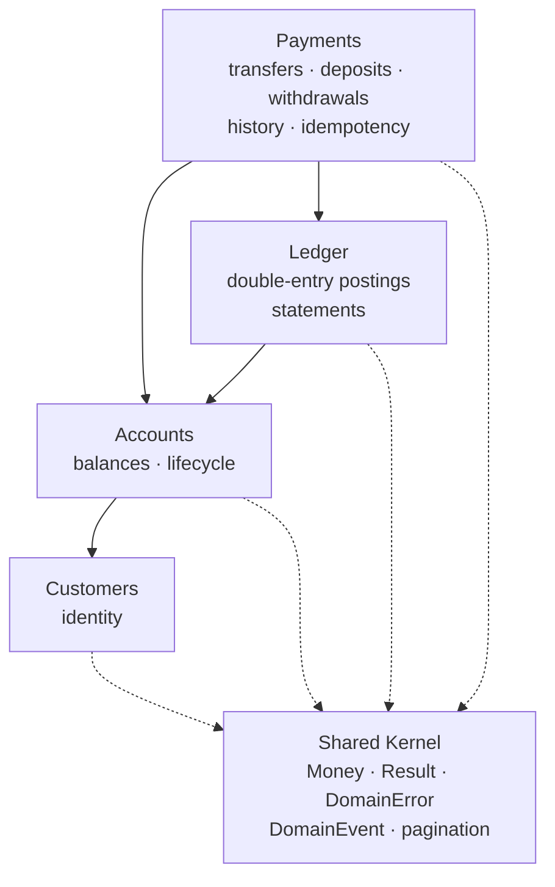
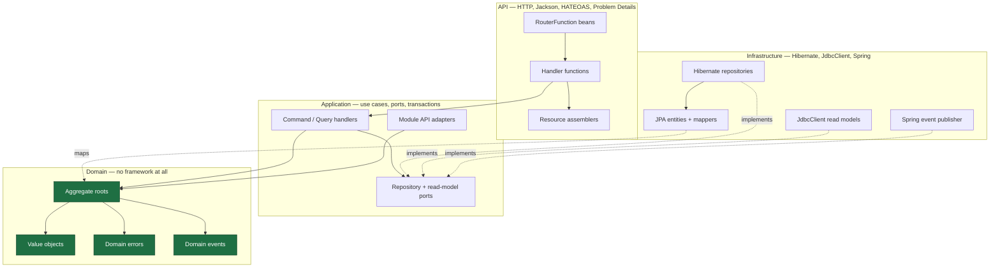

# Architecture

The design, stated before the code and kept in step with it. Everything here is enforced by
`ArchitectureTest` (22 ArchUnit rules) and `ModularityTest` (Spring Modulith), so a claim that stops
being true fails the build.

---

## 1. Bounded contexts

Four business contexts plus a deliberately small shared kernel.

| Context | Owns | Does not own |
|---|---|---|
| **Customers** | Who the bank's clients are: identity, name, email | Anything about money |
| **Accounts** | Balances, account lifecycle, and the invariants protecting them | Why money moved |
| **Ledger** | The append-only double-entry record and statements | Balances (it can derive them, but does not hold them) |
| **Payments** | Financial operations: transfers, deposits, withdrawals, transaction history, idempotency | Balance rules, posting rules |
| **Shared Kernel** | `Money`, `Result`, `DomainError`, `DomainEvent`, `AggregateRoot`, pagination, API plumbing | Any business rule |

Two decisions worth stating explicitly, because both are easy to get wrong:

**Deposits and withdrawals belong to Payments, not Accounts.** The URL is
`POST /api/v1/accounts/{id}/deposits`, which suggests Accounts owns it. But a deposit produces a payment
transaction and ledger postings, and if Accounts created those, `accounts` would import `payments` while
`payments` already imports `accounts`. Modulith fails the build on that cycle, correctly: neither module
could then be understood alone. **URL shape and module ownership are separate decisions.**

**The shared kernel is a liability as well as a convenience.** Everything in it is coupled to everything
that uses it, so it holds value objects and contracts only — never a business rule.

---

## 2. Aggregate roots

| Aggregate | Consistency boundary | Key invariants |
|---|---|---|
| `Customer` | One customer | Valid email, non-blank name |
| `Account` | One balance | Never negative; ACTIVE to transact; currency must match; positive amounts; close only at zero |
| `PaymentTransaction` | One financial operation | Source ≠ destination; PENDING → COMPLETED/FAILED only; both terminal |
| `LedgerTransaction` | One balanced set of postings | Total debits = total credits, single currency, ≥ 2 entries |

Aggregates are kept small and reference each other **by identity only**. `Account` holds a `CustomerId`,
not a `Customer`. A `PaymentTransaction` holds two `AccountId`s, not two `Account`s. An aggregate that
contained both accounts would make the consistency boundary the *pair*, serialising unrelated transfers.

---

## 3. Entities

`LedgerEntry` is the only non-root entity. It has identity (`LedgerEntryId`) but is never loaded,
modified or deleted apart from its `LedgerTransaction`. That is the test for mapping a JPA association at
all — and it is the only association mapped in this codebase.

---

## 4. Value objects

Immutable, self-validating, and used instead of primitives wherever a domain concept exists.

**Shared kernel:** `Money`
**Identity:** `CustomerId`, `AccountId`, `TransactionId`, `LedgerTransactionId`, `LedgerEntryId`, `PostingReference`
**Descriptive:** `AccountNumber`, `EmailAddress`, `PersonName`, `TransactionReference`, `IdempotencyKey`, `IdempotencyRecord`
**Sealed unions:** `LedgerAccountRef` (`Internal` | `External`)
**Enums:** `AccountStatus`, `TransactionStatus`, `TransactionType`, `EntryDirection`, `ErrorType`
**Application:** `PageRequest`, `PageResult<T>`, `SortSpec`, `SortDirection`

`openAccount(customerId, accountId)` cannot be called with the arguments swapped. With two `UUID`
parameters, the compiler could not help.

### Money

```java
public record Money(BigDecimal amount, Currency currency) implements Comparable<Money>
```

- **`BigDecimal`, never `double`.** Binary floating point cannot represent `0.10`, so sums drift.
- **Scale** is normalised on construction to the currency's ISO-4217 minor units — 2 for USD, 0 for JPY,
  3 for BHD.
- **Rounding** is `HALF_EVEN` (banker's rounding). `HALF_UP` biases totals upward across many roundings.
- **Precision** in the database is `NUMERIC(19, 4)`: four fractional digits so three-minor-unit
  currencies fit, fifteen integral digits of headroom.

Normalising scale is what makes equality work. `new BigDecimal("10.0").equals(new BigDecimal("10.00"))`
is `false`, because `BigDecimal#equals` compares scale. Rescaling in the canonical constructor means two
`Money` values representing the same amount are always equal — a requirement for a value object.

`add`/`subtract` throw `CurrencyMismatchException` if currencies differ. That is a **guard, not control
flow**: aggregates check `sameCurrency` first and return `MoneyError.CurrencyMismatch`. Reaching the
exception means a caller skipped the check — a bug, and it should fail loudly rather than silently
produce a wrong balance.

---

## 5. Domain errors

Expected business failures are first-class objects with stable machine-readable codes, returned inside
`Result` — never thrown, never strings.

### The sealed hierarchy in the brief does not compile

The original design called for:

```java
sealed interface DomainError permits AccountError, MoneyError, TransferError, ... { }
```

This is rejected by the compiler:

```
error: class DomainError in unnamed module cannot extend a sealed class in a different package
```

JLS 8.1.1.2 requires every permitted subtype of a sealed type to live in the **same package**, unless the
whole hierarchy is in one **named JPMS module**. Our errors deliberately live in their own bounded
contexts, so a sealed root would either fail to compile or force every module's errors back into one
package — destroying the boundaries this application exists to demonstrate.

**The resolution:** the root `DomainError` is a plain interface; each module seals its *own* hierarchy
with nested records in one file. Exhaustive `switch` still works inside a module. Across modules, callers
use `code()` and `type()`, which is all the HTTP layer needs.

```java
public interface DomainError { String code(); String message(); ErrorType type(); }

public sealed interface AccountError extends DomainError {
    record NotFound(AccountId id) implements AccountError { ... }
    record InsufficientFunds(AccountId id, Money requested, Money available) implements AccountError { ... }
}
```

### Codes

| Code | Type | Meaning |
|---|---|---|
| `ACCOUNT_NOT_FOUND` | NOT_FOUND | No such account |
| `ACCOUNT_NOT_ACTIVE` / `ACCOUNT_FROZEN` / `ACCOUNT_CLOSED` | BUSINESS_RULE | Account cannot transact |
| `ACCOUNT_INSUFFICIENT_FUNDS` | BUSINESS_RULE | Balance too low |
| `ACCOUNT_NOT_EMPTY` | BUSINESS_RULE | Cannot close a funded account |
| `ACCOUNT_INVALID_STATUS_TRANSITION` | BUSINESS_RULE | Illegal lifecycle move |
| `ACCOUNT_NUMBER_ALREADY_IN_USE` | CONFLICT | Duplicate account number |
| `MONEY_CURRENCY_MISMATCH` | BUSINESS_RULE | Currencies differ |
| `MONEY_INVALID_AMOUNT` | VALIDATION | Non-positive amount |
| `MONEY_UNKNOWN_CURRENCY` | VALIDATION | Not an ISO-4217 code |
| `TRANSFER_SAME_ACCOUNT` | BUSINESS_RULE | Source equals destination |
| `TRANSFER_IDEMPOTENCY_KEY_REQUIRED` / `_INVALID` | VALIDATION | Missing or malformed key |
| `TRANSFER_IDEMPOTENCY_KEY_REUSED` | CONFLICT | Same key, different request |
| `TRANSACTION_NOT_FOUND` | NOT_FOUND | No such transaction |
| `TRANSACTION_INVALID_STATE_TRANSITION` | BUSINESS_RULE | e.g. completing twice |
| `LEDGER_UNBALANCED` | BUSINESS_RULE | Debits ≠ credits |
| `LEDGER_MIXED_CURRENCIES` / `LEDGER_TOO_FEW_ENTRIES` | BUSINESS_RULE | Malformed posting set |
| `CUSTOMER_NOT_FOUND` | NOT_FOUND | No such customer |
| `CUSTOMER_EMAIL_ALREADY_REGISTERED` | CONFLICT | Duplicate email |
| `CUSTOMER_INVALID_EMAIL` / `_NAME` | VALIDATION | Malformed input |

### ErrorType is not an HTTP status

`ErrorType` is the domain's own classification — the same idea as `ErrorOr`'s `ErrorType` in .NET. The
mapping to HTTP lives in `ProblemDetailFactory`, outside the domain. A second transport would map the
same errors differently without touching a single aggregate.

| ErrorType | HTTP | Why |
|---|---|---|
| `VALIDATION` | 400 | The request is malformed |
| `NOT_FOUND` | 404 | — |
| `CONFLICT` | 409 | Clashes with existing state |
| `BUSINESS_RULE` | 422 | Well-formed and understood, but forbidden. Insufficient funds is the canonical case: nothing is wrong with the JSON |

---

## 6. Domain events

Past tense, framework-free records. Aggregates **record** events; the application layer publishes them
after persistence.

**Aggregate-local facts** — "this account's balance changed, and why":
`AccountOpened`, `MoneyDeposited`, `MoneyWithdrawn`, `MoneyDebited`, `MoneyCredited`, `AccountFrozen`,
`AccountUnfrozen`, `AccountClosed`, `CustomerRegistered`

**Business-process facts** — "this operation happened":
`TransferInitiated`, `TransferCompleted`, `TransferFailed`, `DepositRecorded`, `WithdrawalRecorded`,
`LedgerTransactionRecorded`

### Why both levels exist

A fraud monitor wants `TransferCompleted` — one event per business operation, carrying both accounts. A
balance-change audit wants `MoneyDebited`/`MoneyCredited` — one event per affected account. Publishing
only the fine-grained events forces every consumer to re-assemble the operation; publishing only the
coarse one hides deposits and withdrawals. Neither level is redundant.

Deposits raise `MoneyDeposited` rather than `MoneyCredited`: customer-initiated cash is a different fact
from an internal transfer posting, even though both change the balance identically.

### Dispatching: before commit, after commit, or async?

**After commit, asynchronously, with a persistent outbox.** `@ApplicationModuleListener` expands to
`@Async` + `@Transactional(REQUIRES_NEW)` + `@TransactionalEventListener(AFTER_COMMIT)`.

- **After commit** — a listener can never see state that later rolls back, and can never roll the
  publisher back.
- **Async** — a slow subscriber cannot lengthen the HTTP request that produced the event.
- **Its own transaction** — the original one is finished by the time the listener runs.

**What is *not* an event:** anything that must be atomic with the state change. The ledger postings for a
transfer are written synchronously inside the transfer's transaction via `LedgerApi`. Moving them to an
after-commit listener would mean a listener failure leaves money moved with no postings, after the client
has already been told it succeeded.

**The cost:** a gap between commit and delivery. Spring Modulith closes it with the `event_publication`
table — each pending invocation is written inside the publishing transaction and marked complete when the
listener succeeds. That is the transactional-outbox pattern, and it makes delivery **at-least-once**.
Handlers must therefore be idempotent.

---

## 7. Module dependencies



Declared, not inferred — `@ApplicationModule(allowedDependencies = ...)` on each package, verified by
`ModularityTest`. Adding a stray import fails the build.

Each module publishes a narrow API in its **root package**; everything below is internal.

| Module | Published |
|---|---|
| Customers | `CustomerId`, `CustomersApi` |
| Accounts | `AccountId`, `AccountsApi`, `AccountPosting`, `TransferPostings` |
| Ledger | `LedgerTransactionId`, `PostingReference`, `LedgerApi` |
| Payments | `PaymentsApi` |

### Two boundary problems and how they were solved

**Ledger must not import `TransactionId`.** Payments owns it and Payments calls the Ledger, so importing
it back would create a cycle. The Ledger declares its own `PostingReference` and Payments translates at
the boundary — a miniature anti-corruption layer.

**No module constructs another's errors.** `CustomersApi.requireExists` and `AccountsApi.requireExists`
return the owning module's error *inside* a `Result`, so a caller propagates a `DomainError` it never
names. Modulith rejected the earlier version, which called `AccountError.notFound(...)` from two other
modules.

---

## 8. Repository abstractions

Domain-oriented ports in the application layer; JPA implementations in infrastructure.

```java
public interface AccountRepository {
    Optional<Account> findById(AccountId id);
    Optional<Account> findByIdForUpdate(AccountId id);   // SELECT ... FOR UPDATE
    Optional<Account> findByAccountNumber(AccountNumber accountNumber);
    boolean existsById(AccountId id);
    boolean existsByAccountNumber(AccountNumber accountNumber);
    void save(Account account);
}
```

No port mentions `JpaRepository`, `EntityManager`, `Page`, `Pageable` or `Sort`. ArchUnit enforces it.

**There is no generic domain repository.** A `Repository<T, ID>` forces meaningless CRUD onto aggregates
that should not have it (nothing deletes an `Account`) and leaves nowhere to express what matters —
`findByIdForUpdate`, `existsByAccountNumber`.

**There *is* a generic Hibernate repository, in infrastructure only.**
`GenericHibernateRepository<E, ID>` removes `EntityManager` boilerplate. Note the type parameter: `E` is
the **JPA entity**, never the aggregate. ArchUnit fails the build if the domain or application layer
references it.

### Read side

Separate ports, separate implementations, `JdbcClient`: `CustomerReadModel`, `AccountReadModel`,
`TransactionReadModel`, `StatementReadModel`. No aggregate is loaded to render a read-only page.

---

## 9. Package structure

```
com.innovatiopr.payments
├── PaymentsApplication.java
├── DevelopmentDataSeeder.java          composition root, @Profile("local")
│
├── shared/                             OPEN module — the kernel
│   ├── domain/                         Money, Result, DomainError, DomainEvent, AggregateRoot
│   ├── application/                    Command, Query, handlers, PageRequest/PageResult, ports
│   ├── infrastructure/                 GenericHibernateRepository, event publisher, SortColumns
│   └── api/                            ProblemDetails, ApiPaths, PagedResources, validation, docs
│
├── customers/
│   ├── CustomerId · CustomersApi       ← published API
│   ├── domain/                         Customer, EmailAddress, PersonName, CustomerError
│   ├── application/                    CustomerRepository, CustomersApiAdapter
│   ├── infrastructure/                 JPA entity, mapper, Hibernate repo, JdbcClient read model
│   ├── registration/{api,application}  ← vertical slice
│   └── directory/{api,application}     ← vertical slice
│
├── accounts/
│   ├── AccountId · AccountsApi · AccountPosting · TransferPostings
│   ├── domain/                         Account, AccountNumber, AccountStatus, AccountError, events
│   ├── application/                    AccountRepository, AccountsApiAdapter
│   ├── infrastructure/
│   ├── opening/{api,application}
│   ├── details/{api,application}
│   └── status/{api,application}
│
├── ledger/
│   ├── LedgerTransactionId · PostingReference · LedgerApi
│   ├── domain/                         LedgerTransaction, LedgerEntry, LedgerAccountRef, LedgerError
│   ├── application/                    LedgerRepository, LedgerApiAdapter
│   ├── infrastructure/
│   └── statements/{api,application}
│
└── payments/
    ├── PaymentsApi
    ├── domain/                         PaymentTransaction, IdempotencyKey, TransactionReference, errors
    ├── application/                    ports, PaymentsApiAdapter
    ├── infrastructure/
    ├── transfer/{api,application}
    ├── deposits/{api,application}
    ├── withdrawals/{api,application}
    └── transactions/{api,application}
```

Three axes at once: **modules** (bounded contexts) → **vertical slices** (features) → **layers** (api /
application / domain / infrastructure). A feature's routes, endpoint, command and handler sit together.

---

## 10. API routes

All functional (`RouterFunction`), grouped by feature. No `@RestController`.

| Method | Path | Slice |
|---|---|---|
| POST | `/api/v1/customers` | customers/registration |
| GET | `/api/v1/customers/{id}` | customers/directory |
| GET | `/api/v1/customers?page&size&sort&direction` | customers/directory |
| POST | `/api/v1/accounts` | accounts/opening |
| GET | `/api/v1/accounts/{id}` | accounts/details |
| GET | `/api/v1/accounts/{id}/balance` | accounts/details |
| POST | `/api/v1/accounts/{id}/freeze` · `/unfreeze` · `/close` | accounts/status |
| POST | `/api/v1/accounts/{id}/deposits` | payments/deposits |
| POST | `/api/v1/accounts/{id}/withdrawals` | payments/withdrawals |
| POST | `/api/v1/transfers` *(Idempotency-Key required)* | payments/transfer |
| GET | `/api/v1/transactions/{id}` | payments/transactions |
| GET | `/api/v1/transactions?page&size&sort&direction&type&status&dateFrom&dateTo&minimumAmount&maximumAmount` | payments/transactions |
| GET | `/api/v1/accounts/{id}/transactions?…` | payments/transactions |
| GET | `/api/v1/accounts/{id}/statement?page&size&from&to` | ledger/statements |
| GET | `/docs` · `/v3/api-docs` · `/actuator/*` | shared/api |

**Status codes:** 201 + `Location` on creation · 200 on read and on idempotent replay · 400 transport
validation · 404 not found · 409 conflict · 422 domain rule · 500 unexpected.

### Three real costs of functional routing

Choosing `RouterFunction` over `@RestController` is not free, and the trade is rarely stated:

1. **`linkTo(methodOn(...))` is unavailable.** It reflects over an annotated controller method; there
   isn't one. Replaced by `ApiPaths` — arguably safer, since a renamed path breaks compilation rather
   than silently emitting a wrong link.
2. **`@Valid` does nothing.** Bean Validation is run by the annotated-controller argument resolvers.
   `RequestValidator` invokes it explicitly.
3. **springdoc generates no paths by default.** It discovers annotated controllers by reflection; a
   `RouterFunction` is an opaque runtime object, so the document came out empty and Scalar rendered a
   blank page without anything failing. Solved with springdoc's `SpringdocRouteBuilder`, which takes an
   operation builder alongside each route — documentation and route are declared together and cannot
   drift. `OpenApiDocumentIT` asserts all 16 operations, their ids, summaries, tags, responses and
   request schemas.

---

## 11. HATEOAS model

`application/hal+json`, Spring HATEOAS `RepresentationModel`, dedicated assemblers per resource. Never a
persistence object on the wire.

**Affordances follow domain state.** A client should not have to encode the bank's rules; it looks for a
link and finds one, or does not.

| State | Links |
|---|---|
| **ACTIVE** | `self`, `balance`, `transactions`, `statement`, `customer`, `deposit`, `withdraw`, `transfer`, `freeze` (+ `close` only at a zero balance) |
| **FROZEN** | read links + `unfreeze` (+ `close` at zero). **No** `deposit`/`withdraw`/`transfer` — frozen accounts can neither send nor receive |
| **CLOSED** | read links only |

`HateoasIT` asserts that the absent links are honest: freeze an account, call the withdrawal endpoint
anyway, and the API returns 422.

---

## 12. Pagination model

Framework-neutral `PageRequest` / `PageResult<T>` / `SortSpec`. Spring Data's `Page`, `Pageable` and
`Sort` never leave infrastructure — ArchUnit enforces it.

- Default size **20**, maximum **100**. Out-of-range input is **normalised, not rejected**, and the
  effective values are echoed back in `page`.
- **Deterministic ordering.** Every `ORDER BY` appends a unique tiebreaker (`id`). Sorting by `created_at`
  alone is not a total order — rows written in one transaction share a timestamp — and with
  `LIMIT`/`OFFSET` an unstable order makes a row appear on two pages and another on none.
- **Sorting is allow-listed.** `ORDER BY` cannot be a bind parameter, so the column name is part of the
  statement text. A request names a *logical* field; `SortColumns` maps it, and an unknown name falls
  back to the default. No query-string value ever reaches the SQL.
- **Filters apply to the page and its count.** Both statements share one `WHERE` builder, so a client is
  never told there are twelve pages of a filtered set and then handed an empty page three.
- **Links describe pages that exist.** `prev`/`next` appear only when they do, and every generated URL
  preserves filters, sort and the effective size.

---

## 13. Persistence strategy

**Write side — JPA/Hibernate.** Aggregates are plain objects; a separate `*JpaEntity` carries the
annotations, and a mapper translates. Hibernate needs a no-arg constructor, non-final fields and
setters — exactly the shape a rich domain model must not have.

**Read side — `JdbcClient`** (the Dapper equivalent). Optimised projections that a write model should not
attempt. The clearest case is the account statement's running balance:

```sql
SUM(CASE WHEN direction = 'CREDIT' THEN amount ELSE -amount END)
    OVER (ORDER BY recorded_at, id ROWS BETWEEN UNBOUNDED PRECEDING AND CURRENT ROW)
```

Page three of a statement still needs the balance carried forward from every earlier posting. Through the
write model that means loading every entry into memory on every request.

**Schema — Flyway, `ddl-auto: validate`.** Hibernate never changes the schema; it only checks that its
mappings match.

**Invariants are enforced twice.** The domain check produces a good error message; the database check
gives the guarantee — against a defective code path, a bad migration, or a manual `UPDATE`.

| Constraint | Backs |
|---|---|
| `CHECK (balance >= 0)` | `Account.debit` rejecting an overdraft |
| `CHECK (total_debits = total_credits)` | The ledger's defining invariant |
| `CHECK (source_account_id IS DISTINCT FROM destination_account_id)` | `TRANSFER_SAME_ACCOUNT` |
| `CHECK (num_nonnulls(account_id, external_account) = 1)` | `LedgerAccountRef`'s two cases |
| `PRIMARY KEY (idempotency_key)` | Exactly-once money movement |
| `UNIQUE (posting_reference)` | One ledger transaction per operation |
| `CHECK` on status/type/leg combinations | Aggregate state machines |

---

## 14. Transaction strategy

`@Transactional` on **application handlers**. Never on a `RouterFunction`, a handler function, or a
domain object.

### Spring's transactional proxy, and the trap

`@Transactional` is implemented by a proxy: callers get the proxy, it opens the transaction, then
delegates. So a call from one method of a bean to **another method of the same bean** goes straight to
the target and bypasses the proxy — the annotation silently does nothing. It is invisible until something
needs to roll back.

That is also why `@Transactional` on a functional endpoint is inert: the handler is invoked as a method
reference by the `DispatcherServlet`, not through a Spring proxy. An ArchUnit rule forbids it.

### What a transfer commits together

Source balance · destination balance · payment transaction · ledger postings · idempotency record. One
transaction, all or nothing.

### Concurrency: pessimistic for transfers

| | Optimistic (`@Version`) | Pessimistic (`FOR UPDATE`) |
|---|---|---|
| Mechanism | Detects a conflict at write time | Prevents it at read time |
| On conflict | Fails, caller retries | Second caller waits |
| Suits | Low contention, cheap retry | High contention, expensive retry |

**Transfers use pessimistic locking.** Under optimistic locking, two concurrent transfers on the same
account both read the balance, both decide there are sufficient funds, and one fails at commit — after
doing all its work. Worse, the retry has to be safe, and retrying money movement needs the idempotency
machinery to be flawless. A row lock makes the second transaction *wait* and then read the balance the
first actually left. `@Version` is still present and guards non-transfer updates.

### Deterministic lock ordering

`postTransfer` sorts the two account ids and locks in ascending order, always. Without it:

```
thread 1: lock A … wants B
thread 2: lock B … wants A     → deadlock
```

PostgreSQL detects the cycle and kills one transaction — a 500 for a valid request. With a total order,
both threads take A first and one simply waits. A cycle requires someone to acquire locks in descending
order.

One subtlety: `UUID.compareTo` compares the halves as **signed** longs, so `ffffffff-…` sorts *before*
`00000000-…-0001`. That is fine — deadlock avoidance needs only *some* consistent order — but it would
matter if the same comparator were used for display or keyset pagination, so it is not.

### Idempotency

`POST /api/v1/transfers` requires `Idempotency-Key`. Stored: key, request hash, transaction id, response
status, timestamp.

| Case | Response |
|---|---|
| New key | Do the work · **201** |
| Known key, same request | Original result, no money moved · **200** |
| Known key, different request | **409** — replaying would answer a different question |

**The unique index is the concurrency control, not the prior read.** Two requests with one key can both
find nothing and both proceed; the index makes the second inserter wait for the first to commit and then
rejects it, rolling its whole transaction back.

That rollback drives an unusual structure. A constraint violation leaves the PostgreSQL transaction
aborted, so nothing further can be read on it — the retry lookup must happen *after* it unwinds. Hence
three beans: `TransferMoneyHandler` (no transaction), `TransferMoneyOperation` (`@Transactional`), and
`TransferReplayReader` (`REQUIRES_NEW`). Catching the violation inside the transactional method would
leave the handler holding a dead connection.

---

## 15. Dependency diagram



**Every arrow points inward.** Infrastructure → Application → Domain, and API → Application → Domain. The
domain sits at the centre and depends on nothing but the JDK. Infrastructure implements ports the
application declares — the dependency-inversion arrows are the dashed ones.

The domain has no import of Spring, Hibernate, JPA, Jackson, HTTP, HATEOAS, Bean Validation, or any
infrastructure package. Eight ArchUnit rules check each of those individually, so this is a property of
the build rather than a claim in a document.
