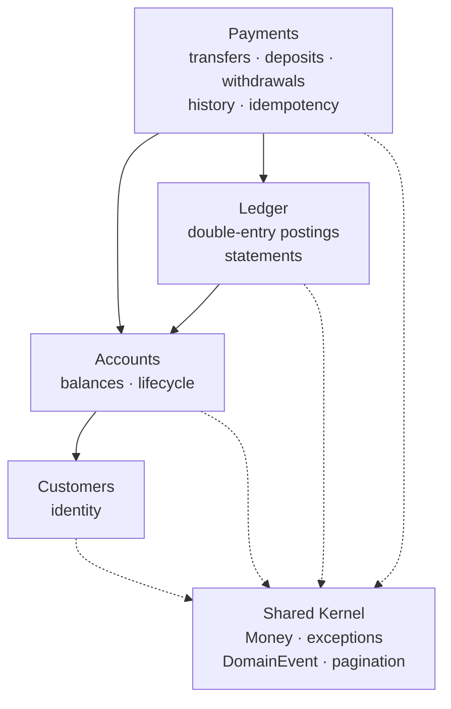
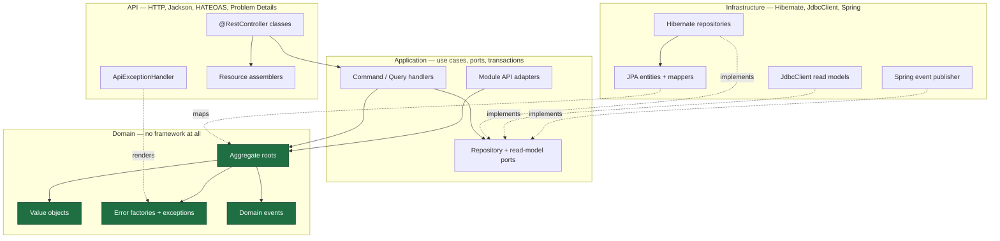

# Architecture

The design, stated before the code and kept in step with it. Every claim here is enforced by the build,
so one that stops being true fails it:

| Mechanism | Enforces |
|---|---|
| **Maven modules** (5, one per layer) | The dependency rule, at compile time — the domain cannot import a framework that is not on its classpath |
| **`LayerModuleIsolationTest`** (7 tests) | That the POMs stay isolated and do not drift |
| **`ArchitectureTest`** (27 ArchUnit rules) | What a POM cannot express: no JPA entity outside infrastructure, no `@Transactional` on a controller, no Spring Data `Page` in a use case, no `Result` type returning a failure a caller can ignore |
| **`ModularityTest`** (Spring Modulith) | Bounded-context boundaries and the absence of cycles |
| **`OpenApiDocumentIT`** (8 tests) | That every route reaches the OpenAPI document under its published `operationId`, and that failures are documented as `problem+json` |

---

## 1. Bounded contexts

Four business contexts plus a deliberately small shared kernel.

| Context | Owns | Does not own |
|---|---|---|
| **Customers** | Who the bank's clients are: identity, name, email | Anything about money |
| **Accounts** | Balances, account lifecycle, and the invariants protecting them | Why money moved |
| **Ledger** | The append-only double-entry record and statements | Balances (it can derive them, but does not hold them) |
| **Payments** | Financial operations: transfers, deposits, withdrawals, transaction history, idempotency | Balance rules, posting rules |
| **Shared Kernel** | `Money`, the exception hierarchy, `DomainEvent`, `AggregateRoot`, pagination, API plumbing | Any business rule |

Two decisions worth stating explicitly, because both are easy to get wrong:

**Deposits and withdrawals belong to Payments, not Accounts.** The URL is
`POST /api/v1/accounts/{id}/deposits`, which suggests Accounts owns it. But a deposit produces a payment
transaction and ledger postings, and if Accounts created those, `accounts` would import `payments` while
`payments` already imports `accounts`. Modulith fails the build on that cycle, correctly: neither module
could then be understood alone. **URL shape and module ownership are separate decisions.**

**The shared kernel is a liability as well as a convenience.** Everything in it is coupled to everything
that uses it, so it holds value objects and contracts only — never a business rule.

---

## 2. Aggregate roots

| Aggregate | Consistency boundary | Key invariants |
|---|---|---|
| `Customer` | One customer | Valid email, non-blank name |
| `Account` | One balance | Never negative; ACTIVE to transact; currency must match; positive amounts; close only at zero |
| `PaymentTransaction` | One financial operation | Source ≠ destination; PENDING → COMPLETED/FAILED only; both terminal |
| `LedgerTransaction` | One balanced set of postings | Total debits = total credits, single currency, ≥ 2 entries |

Aggregates are kept small and reference each other **by identity only**. `Account` holds a `CustomerId`,
not a `Customer`. A `PaymentTransaction` holds two `AccountId`s, not two `Account`s. An aggregate that
contained both accounts would make the consistency boundary the *pair*, serialising unrelated transfers.

---

## 3. Entities

`LedgerEntry` is the only non-root entity. It has identity (`LedgerEntryId`) but is never loaded,
modified or deleted apart from its `LedgerTransaction`. That is the test for mapping a JPA association at
all — and it is the only association mapped in this codebase.

---

## 4. Value objects

Immutable, self-validating, and used instead of primitives wherever a domain concept exists.

**Shared kernel:** `Money`
**Identity:** `CustomerId`, `AccountId`, `TransactionId`, `LedgerTransactionId`, `LedgerEntryId`, `PostingReference`
**Descriptive:** `AccountNumber`, `EmailAddress`, `PersonName`, `TransactionReference`, `IdempotencyKey`, `IdempotencyRecord`
**Sealed unions:** `LedgerAccountRef` (`Internal` | `External`)
**Enums:** `AccountStatus`, `TransactionStatus`, `TransactionType`, `EntryDirection`
**Application:** `PageRequest`, `PageResult<T>`, `SortSpec`, `SortDirection`

`openAccount(customerId, accountId)` cannot be called with the arguments swapped. With two `UUID`
parameters, the compiler could not help.

### Money

```java
public record Money(BigDecimal amount, Currency currency) implements Comparable<Money>
```

- **`BigDecimal`, never `double`.** Binary floating point cannot represent `0.10`, so sums drift.
- **Scale** is normalised on construction to the currency's ISO-4217 minor units — 2 for USD, 0 for JPY,
  3 for BHD.
- **Rounding** is `HALF_EVEN` (banker's rounding). `HALF_UP` biases totals upward across many roundings.
- **Precision** in the database is `NUMERIC(19, 4)`: four fractional digits so three-minor-unit
  currencies fit, fifteen integral digits of headroom.

Normalising scale is what makes equality work. `new BigDecimal("10.0").equals(new BigDecimal("10.00"))`
is `false`, because `BigDecimal#equals` compares scale. Rescaling in the canonical constructor means two
`Money` values representing the same amount are always equal — a requirement for a value object.

`add`/`subtract` throw `CurrencyMismatchException` if currencies differ. That is a **guard, not control
flow**: aggregates check `sameCurrency` first and return `MoneyError.CurrencyMismatch`. Reaching the
exception means a caller skipped the check — a bug, and it should fail loudly rather than silently
produce a wrong balance.

---

## 5. Domain errors

Expected business failures are **thrown**, as typed exceptions carrying a stable machine-readable code —
never returned inside a wrapper, never strings.

### Why exceptions and not `Result<T>`

An earlier design returned a `sealed interface Result<T>`, a transplant of .NET's `ErrorOr<T>`. It worked
and it read well, and it was wrong for a reason that only shows up under a transaction:

> **A `@Transactional` method that returns a failure commits.**

`TransferMoneyOperation` mutates two managed `Account` entities in `postTransfer` and only then writes the
ledger. With `Result`, a ledger failure *returned* from that method let Hibernate flush both balance
changes at commit — money moved, no ledger rows, no payment transaction to explain it. The balance and the
ledger disagreed permanently, in an application whose entire purpose is an auditable ledger.

Throwing makes the rollback Spring's job. `TransferRollbackIT` injects a failing ledger and asserts the
balances are untouched, so the old behaviour cannot come back quietly.

The corollary is a rule for callers, and it is the one thing this model asks you to remember:

> Code running inside a transaction must **not** catch a domain exception and carry on. The transaction is
> already marked rollback-only, so the commit fails with `UnexpectedRollbackException`.

`TransferMoneyHandler` is the one place that catches — and it deliberately has no `@Transactional` of its
own, precisely so its `catch` runs after the operation's transaction has unwound.

### The type is the classification

There is no separate `ErrorType` enum. The exception's class carries the meaning, so nothing can disagree
with anything else:

| Exception | HTTP | Why |
|---|---|---|
| `ValidationException` | 400 | The value could not be accepted in any state of the world |
| `NotFoundException` | 404 | — |
| `ConflictException` | 409 | Clashes with existing state |
| `DomainException` | 422 | Well-formed and understood, but an invariant forbids it. Insufficient funds is the canonical case: nothing is wrong with the JSON, so telling the client to fix its request would be a lie |
| `ForbiddenException` | 403 | Reserved; nothing throws it until there is authentication |

All five live in `payments-domain` and are plain `RuntimeException`s — no Spring, no Jakarta — so the
domain-purity rules hold. They sit one layer further in than the .NET reference puts them, because the
published module contracts (`AccountsApi`, `CustomersApi`, …) are declared in the domain module and name
these types in their `@throws` clauses.

The mapping to HTTP lives in `ApiExceptionHandler`, outside the domain. A second transport would map the
same exceptions differently without touching a single aggregate.

### Where they are constructed

Never inline. Each bounded context owns a `*Errors` class — a `final class` with a private constructor and
static factories — which is the single place a code is paired with its message:

```java
public final class AccountErrors {
    public static NotFoundException notFound(AccountId id) { ... }
    public static DomainException insufficientFunds(AccountId id, Money requested, Money available) { ... }
}
```

`AccountErrors`, `CustomerErrors`, `LedgerErrors`, `TransactionErrors`, `TransferErrors`, `MoneyErrors`.
ArchUnit asserts they are final and that every public method returns a `RuntimeException`.

### Codes

Every `code` is a published contract: clients may branch on it, so it does not change. It is reported in
the `code` extension of every problem document.

| Code | Exception | Meaning |
|---|---|---|
| `ACCOUNT_NOT_FOUND` | `NotFoundException` | No such account |
| `ACCOUNT_NOT_ACTIVE` / `ACCOUNT_FROZEN` / `ACCOUNT_CLOSED` | `DomainException` | Account cannot transact |
| `ACCOUNT_INSUFFICIENT_FUNDS` | `DomainException` | Balance too low |
| `ACCOUNT_NOT_EMPTY` | `DomainException` | Cannot close a funded account |
| `ACCOUNT_INVALID_STATUS_TRANSITION` | `DomainException` | Illegal lifecycle move |
| `ACCOUNT_NUMBER_ALREADY_IN_USE` | `ConflictException` | Duplicate account number |
| `ACCOUNT_INVALID_NUMBER` | `ValidationException` | Malformed account number |
| `MONEY_CURRENCY_MISMATCH` | `DomainException` | Currencies differ |
| `MONEY_INVALID_AMOUNT` | `ValidationException` | Non-positive amount |
| `MONEY_UNKNOWN_CURRENCY` | `ValidationException` | Not an ISO-4217 code |
| `TRANSFER_SAME_ACCOUNT` | `DomainException` | Source equals destination |
| `TRANSFER_IDEMPOTENCY_KEY_REQUIRED` / `_INVALID` | `ValidationException` | Missing or malformed key |
| `TRANSFER_IDEMPOTENCY_KEY_REUSED` | `ConflictException` | Same key, different request |
| `TRANSFER_INVALID_REFERENCE` | `ValidationException` | Reference too long |
| `TRANSACTION_NOT_FOUND` | `NotFoundException` | No such transaction |
| `TRANSACTION_INVALID_STATE_TRANSITION` | `DomainException` | e.g. completing twice |
| `LEDGER_UNBALANCED` | `DomainException` | Debits ≠ credits |
| `LEDGER_MIXED_CURRENCIES` / `LEDGER_TOO_FEW_ENTRIES` | `DomainException` | Malformed posting set |
| `LEDGER_TRANSACTION_NOT_FOUND` | `NotFoundException` | No such ledger transaction |
| `CUSTOMER_NOT_FOUND` | `NotFoundException` | No such customer |
| `CUSTOMER_EMAIL_ALREADY_REGISTERED` | `ConflictException` | Duplicate email |
| `CUSTOMER_INVALID_EMAIL` / `_NAME` | `ValidationException` | Malformed input |

Transport-level failures raised before any handler runs carry codes of their own:
`REQUEST_VALIDATION_FAILED` (400, with a per-field `errors` array), `INVALID_IDENTIFIER` (400),
`REQUEST_BODY_UNREADABLE` (400), `ENDPOINT_NOT_FOUND` (404), `METHOD_NOT_ALLOWED` (405),
`CONCURRENT_MODIFICATION` (409), `RESOURCE_ALREADY_EXISTS` (409), `INVALID_REFERENCE` (400),
`UPSTREAM_TIMEOUT` (504), `INTERNAL_ERROR` (500).

---

## 6. Domain events

Past tense, framework-free records. Aggregates **record** events; the application layer publishes them
after persistence.

**Aggregate-local facts** — "this account's balance changed, and why":
`AccountOpened`, `MoneyDeposited`, `MoneyWithdrawn`, `MoneyDebited`, `MoneyCredited`, `AccountFrozen`,
`AccountUnfrozen`, `AccountClosed`, `CustomerRegistered`

**Business-process facts** — "this operation happened":
`TransferInitiated`, `TransferCompleted`, `TransferFailed`, `DepositRecorded`, `WithdrawalRecorded`,
`LedgerTransactionRecorded`

### Why both levels exist

A fraud monitor wants `TransferCompleted` — one event per business operation, carrying both accounts. A
balance-change audit wants `MoneyDebited`/`MoneyCredited` — one event per affected account. Publishing
only the fine-grained events forces every consumer to re-assemble the operation; publishing only the
coarse one hides deposits and withdrawals. Neither level is redundant.

Deposits raise `MoneyDeposited` rather than `MoneyCredited`: customer-initiated cash is a different fact
from an internal transfer posting, even though both change the balance identically.

### Dispatching: before commit, after commit, or async?

**After commit, asynchronously, with a persistent outbox.** `@ApplicationModuleListener` expands to
`@Async` + `@Transactional(REQUIRES_NEW)` + `@TransactionalEventListener(AFTER_COMMIT)`.

- **After commit** — a listener can never see state that later rolls back, and can never roll the
  publisher back.
- **Async** — a slow subscriber cannot lengthen the HTTP request that produced the event.
- **Its own transaction** — the original one is finished by the time the listener runs.

**What is *not* an event:** anything that must be atomic with the state change. The ledger postings for a
transfer are written synchronously inside the transfer's transaction via `LedgerApi`. Moving them to an
after-commit listener would mean a listener failure leaves money moved with no postings, after the client
has already been told it succeeded.

**The cost:** a gap between commit and delivery. Spring Modulith closes it with the `event_publication`
table — each pending invocation is written inside the publishing transaction and marked complete when the
listener succeeds. That is the transactional-outbox pattern, and it makes delivery **at-least-once**.
Handlers must therefore be idempotent.

---

## 7. Module dependencies



Declared, not inferred — `@ApplicationModule(allowedDependencies = ...)` on each package, verified by
`ModularityTest`. Adding a stray import fails the build.

Each module publishes a narrow API in its **root package**; everything below is internal.

| Module | Published |
|---|---|
| Customers | `CustomerId`, `CustomersApi` |
| Accounts | `AccountId`, `AccountsApi`, `AccountPosting`, `TransferPostings` |
| Ledger | `LedgerTransactionId`, `PostingReference`, `LedgerApi` |
| Payments | `PaymentsApi` |

### Two boundary problems and how they were solved

**Ledger must not import `TransactionId`.** Payments owns it and Payments calls the Ledger, so importing
it back would create a cycle. The Ledger declares its own `PostingReference` and Payments translates at
the boundary — a miniature anti-corruption layer.

**No module constructs another's errors.** `CustomersApi.requireExists` and `AccountsApi.requireExists`
throw the owning module's own exception, so a caller never names the concrete error type — it asks the
question and lets the answer propagate. Modulith rejected the earlier version, which called
`AccountErrors.notFound(...)` from two other modules.

---

## 8. Repository abstractions

Domain-oriented ports in the application layer; JPA implementations in infrastructure.

```java
public interface AccountRepository {
    Optional<Account> findById(AccountId id);
    Optional<Account> findByIdForUpdate(AccountId id);   // SELECT ... FOR UPDATE
    Optional<Account> findByAccountNumber(AccountNumber accountNumber);
    boolean existsById(AccountId id);
    boolean existsByAccountNumber(AccountNumber accountNumber);
    void save(Account account);
}
```

No port mentions `JpaRepository`, `EntityManager`, `Page`, `Pageable` or `Sort` — and in the
multi-module build it could not: `payments-application` has neither Hibernate nor Spring Data on its
compile classpath. ArchUnit keeps the rule stated explicitly as well, for the cases a POM cannot cover.

**There is no generic domain repository.** A `Repository<T, ID>` forces meaningless CRUD onto aggregates
that should not have it (nothing deletes an `Account`) and leaves nowhere to express what matters —
`findByIdForUpdate`, `existsByAccountNumber`.

**There *is* a generic Hibernate repository, in infrastructure only.**
`GenericHibernateRepository<E, ID>` removes `EntityManager` boilerplate. Note the type parameter: `E` is
the **JPA entity**, never the aggregate. It lives in `payments-infrastructure`, which the domain and
application modules do not depend on — so referencing it from a use case is a compile error, and
ArchUnit states the rule as well.

### Read side

Separate ports, separate implementations, `JdbcClient`: `CustomerReadModel`, `AccountReadModel`,
`TransactionReadModel`, `StatementReadModel`. No aggregate is loaded to render a read-only page.

---

## 9. Module and package structure

### Maven modules — the layers

```
payments-parent  (pom, aggregator + dependencyManagement)
├── payments-domain           ← classpath: jspecify + spring-modulith-api (provided). Nothing else.
├── payments-application      ← + domain, spring-context, spring-tx, slf4j-api
├── payments-infrastructure   ← + application, data-jpa, jdbc, flyway, postgresql, modulith-jdbc
├── payments-api              ← + application, webmvc, hateoas, validation, springdoc, scalar-core
└── payments-bootstrap        ← + api, infrastructure, actuator, opentelemetry. The runnable jar.
```

The dependency rule is a property of the build, not of a test. `payments-domain` cannot import Spring
because Spring is not on its compile classpath; `payments-api` cannot import a JPA entity because
`payments-infrastructure` is not on its classpath. `LayerModuleIsolationTest` reads the POMs and asserts
each of these so they cannot drift.

ArchUnit then covers what a POM cannot express: no JPA entity outside infrastructure, no
`@Transactional` on a route, no Spring Data `Page` in a use case, no field injection.

### Packages — the bounded contexts

Package names are identical to the single-module layout; only the physical module differs. Three axes at
once: **layer** (Maven module) → **bounded context** (package) → **vertical slice** (package).

```
payments-domain/src/main/java/com/innovatiopr/payments/
├── shared/domain/                      Money, DomainException, NotFoundException, ConflictException,
│                                       ValidationException, ForbiddenException, DomainEvent, AggregateRoot
├── customers/                          CustomerId · CustomersApi        ← published contract
│   └── domain/                         Customer, EmailAddress, PersonName, CustomerErrors
├── accounts/                           AccountId · AccountsApi · AccountPosting · TransferPostings
│   └── domain/                         Account, AccountNumber, AccountStatus, AccountErrors, events
├── ledger/                             LedgerTransactionId · PostingReference · LedgerApi
│   └── domain/                         LedgerTransaction, LedgerEntry, LedgerAccountRef, LedgerErrors
└── payments/                           PaymentsApi
    └── domain/                         PaymentTransaction, IdempotencyKey, TransactionReference, errors

payments-application/src/main/java/com/innovatiopr/payments/
├── shared/application/                 Command, Query, handlers, PageRequest/PageResult, ports
├── customers/application/              CustomerRepository, CustomersApiAdapter
├── customers/registration/application/     ← vertical slice
├── customers/directory/application/        ← vertical slice
├── accounts/application/               AccountRepository, AccountsApiAdapter
├── accounts/{opening,details,status}/application/
├── ledger/application/                 LedgerRepository, LedgerApiAdapter
├── ledger/statements/application/
├── payments/application/               ports, PaymentsApiAdapter
└── payments/{transfer,deposits,withdrawals,transactions}/application/

payments-infrastructure/src/main/java/com/innovatiopr/payments/
├── shared/infrastructure/              GenericHibernateRepository, event publisher, SortColumns
├── {customers,accounts,ledger,payments}/infrastructure/
│                                       JPA entities, mappers, Hibernate repos, JdbcClient read models
└── (resources) db/migration/           Flyway migrations

payments-api/src/main/java/com/innovatiopr/payments/
├── shared/api/                         ProblemDetails, ApiExceptionHandler, ApiPaths, ApiResponses,
│                                       PageQuery, QueryValues, PagedResources, CorrelationIdFilter
├── shared/api/docs/                    OpenApiConfiguration, OpenApiDocs, PaymentsOperationCustomizer,
│                                       Scalar routes (the one remaining RouterFunction)
└── <context>/<slice>/api/              Controller, Request, Resource, Assembler

payments-bootstrap/src/main/java/com/innovatiopr/payments/
├── PaymentsApplication.java            @SpringBootApplication + @Modulithic
└── DevelopmentDataSeeder.java          @Profile("local"), drives the published module APIs
```

A vertical slice is therefore split across `payments-application` and `payments-api`. The package path
still reads as one slice (`payments.transfer.application` / `payments.transfer.api`) but the files are in
different modules — the same trade .NET makes with feature folders inside each project. It buys the
compile-time layer guarantee.

## 10. API routes

Annotated `@RestController` classes, one per vertical slice. The class-level `@RequestMapping` takes
its path from an `ApiPaths` constant, so a path exists exactly once in the codebase.

| Method | Path | Slice |
|---|---|---|
| POST | `/api/v1/customers` | customers/registration |
| GET | `/api/v1/customers/{id}` | customers/directory |
| GET | `/api/v1/customers?page&size&sort&direction` | customers/directory |
| POST | `/api/v1/accounts` | accounts/opening |
| GET | `/api/v1/accounts/{id}` | accounts/details |
| GET | `/api/v1/accounts/{id}/balance` | accounts/details |
| POST | `/api/v1/accounts/{id}/freeze` · `/unfreeze` · `/close` | accounts/status |
| POST | `/api/v1/accounts/{id}/deposits` | payments/deposits |
| POST | `/api/v1/accounts/{id}/withdrawals` | payments/withdrawals |
| POST | `/api/v1/transfers` *(Idempotency-Key required)* | payments/transfer |
| GET | `/api/v1/transactions/{id}` | payments/transactions |
| GET | `/api/v1/transactions?page&size&sort&direction&type&status&dateFrom&dateTo&minimumAmount&maximumAmount` | payments/transactions |
| GET | `/api/v1/accounts/{id}/transactions?…` | payments/transactions |
| GET | `/api/v1/accounts/{id}/statement?page&size&from&to` | ledger/statements |
| GET | `/docs` · `/v3/api-docs` · `/actuator/*` | shared/api |

**Status codes:** 201 + `Location` on creation · 200 on read and on idempotent replay · 400 transport
validation · 404 not found · 409 conflict · 422 domain rule · 500 unexpected.

### One controller per slice, not per context

The .NET reference groups Minimal API endpoints under a context root that delegates to per-feature
groups. In Spring the two things that grouping carries — a shared path prefix and a documentation tag —
are a class-level `@RequestMapping` and a `@Tag`, neither of which needs one class per context. Several
controllers may share a base path; Spring only rejects identical method-and-pattern pairs.

So the controller matches the slice, as every other layer does. An aggregated `PaymentsController` would
take nine constructor parameters and every slice change would touch one shared file.

### The one cost that survived the move to controllers

`linkTo(methodOn(...))` works again — but **only for links that stay inside one module**.
`AccountResourceAssembler` emits links into `customers`, `payments` and `ledger`, and naming those
controllers would import another module's internal package: legal Java that `ModularityTest` fails the
build on, and rightly, since that coupling is what the module boundaries exist to prevent.

Since some links cannot use the reflective builder, **all of them use `ApiPaths`**. One mechanism that
always works beats two that each work half the time and leave the reader deciding which applies. It also
fails earlier: a renamed path breaks compilation rather than silently emitting a wrong link.

Two things the move restored:

- **`@Valid` works**, so `RequestValidator` is gone. A body that breaks Bean Validation raises
  `MethodArgumentNotValidException`, which `ApiExceptionHandler` renders as a 400 with a per-field
  `errors` array.
- **springdoc generates paths, schemas and parameter types by reflection**, so only the prose is written
  by hand. Each method still declares an explicit `@Operation(operationId = …)`: springdoc would
  otherwise derive the id from the Java method name and produce `getById_1`, silently renaming operations
  in every generated client. `OpenApiDocumentIT` asserts all 16 ids exactly, along with summaries, tags,
  response sets, request schemas, and that every 4xx is documented as `application/problem+json`.

### Query parameters are bound as `String`

`PageQuery` and `TransactionFilterQuery` are `@ParameterObject` records whose components are all
`String`, and they parse leniently. Binding `page` and `size` to `Integer` would let Spring reject
`?size=banana` with a 400 before the controller ran, and this API's documented contract is that an
unparseable paging or filter value falls back to the default. `PageRequest` then clamps whatever it is
given, so no request can ask for an unbounded result set.

---

## 11. HATEOAS model

`application/hal+json`, Spring HATEOAS `RepresentationModel`, dedicated assemblers per resource. Never a
persistence object on the wire.

**Affordances follow domain state.** A client should not have to encode the bank's rules; it looks for a
link and finds one, or does not.

| State | Links |
|---|---|
| **ACTIVE** | `self`, `balance`, `transactions`, `statement`, `customer`, `deposit`, `withdraw`, `transfer`, `freeze` (+ `close` only at a zero balance) |
| **FROZEN** | read links + `unfreeze` (+ `close` at zero). **No** `deposit`/`withdraw`/`transfer` — frozen accounts can neither send nor receive |
| **CLOSED** | read links only |

`HateoasIT` asserts that the absent links are honest: freeze an account, call the withdrawal endpoint
anyway, and the API returns 422.

---

## 12. Pagination model

Framework-neutral `PageRequest` / `PageResult<T>` / `SortSpec`. Spring Data's `Page`, `Pageable` and
`Sort` never leave infrastructure — ArchUnit enforces it.

- Default size **20**, maximum **100**. Out-of-range input is **normalised, not rejected**, and the
  effective values are echoed back in `page`.
- **Deterministic ordering.** Every `ORDER BY` appends a unique tiebreaker (`id`). Sorting by `created_at`
  alone is not a total order — rows written in one transaction share a timestamp — and with
  `LIMIT`/`OFFSET` an unstable order makes a row appear on two pages and another on none.
- **Sorting is allow-listed.** `ORDER BY` cannot be a bind parameter, so the column name is part of the
  statement text. A request names a *logical* field; `SortColumns` maps it, and an unknown name falls
  back to the default. No query-string value ever reaches the SQL.
- **Filters apply to the page and its count.** Both statements share one `WHERE` builder, so a client is
  never told there are twelve pages of a filtered set and then handed an empty page three.
- **Links describe pages that exist.** `prev`/`next` appear only when they do, and every generated URL
  preserves filters, sort and the effective size.

---

## 13. Persistence strategy

**Write side — JPA/Hibernate.** Aggregates are plain objects; a separate `*JpaEntity` carries the
annotations, and a mapper translates. Hibernate needs a no-arg constructor, non-final fields and
setters — exactly the shape a rich domain model must not have.

**Read side — `JdbcClient`** (the Dapper equivalent). Optimised projections that a write model should not
attempt. The clearest case is the account statement's running balance:

```sql
SUM(CASE WHEN direction = 'CREDIT' THEN amount ELSE -amount END)
    OVER (ORDER BY recorded_at, id ROWS BETWEEN UNBOUNDED PRECEDING AND CURRENT ROW)
```

Page three of a statement still needs the balance carried forward from every earlier posting. Through the
write model that means loading every entry into memory on every request.

**Schema — Flyway, `ddl-auto: validate`.** Hibernate never changes the schema; it only checks that its
mappings match.

**Invariants are enforced twice.** The domain check produces a good error message; the database check
gives the guarantee — against a defective code path, a bad migration, or a manual `UPDATE`.

| Constraint | Backs |
|---|---|
| `CHECK (balance >= 0)` | `Account.debit` rejecting an overdraft |
| `CHECK (total_debits = total_credits)` | The ledger's defining invariant |
| `CHECK (source_account_id IS DISTINCT FROM destination_account_id)` | `TRANSFER_SAME_ACCOUNT` |
| `CHECK (num_nonnulls(account_id, external_account) = 1)` | `LedgerAccountRef`'s two cases |
| `PRIMARY KEY (idempotency_key)` | Exactly-once money movement |
| `UNIQUE (posting_reference)` | One ledger transaction per operation |
| `CHECK` on status/type/leg combinations | Aggregate state machines |

---

## 14. Transaction strategy

`@Transactional` on **application handlers**. Never on a controller and never on a domain object.

### Spring's transactional proxy, and the trap

`@Transactional` is implemented by a proxy: callers get the proxy, it opens the transaction, then
delegates. So a call from one method of a bean to **another method of the same bean** goes straight to
the target and bypasses the proxy — the annotation silently does nothing. It is invisible until something
needs to roll back.

### Why the rule against `@Transactional` on a controller got *stronger*

When this API routed functionally, `@Transactional` on a handler function was **inert** — the handler was
invoked as a method reference, never through a proxy, so the annotation did nothing at all. The rule
against it was a warning about a no-op.

A `@RestController` is a proxied Spring bean, so the same annotation now does exactly what it says: it
opens a real transaction, which then wraps JSON serialization, HATEOAS link assembly and the entire
response write, holding a database connection for all of it. The ArchUnit rule forbidding it is unchanged
in form and considerably more important in substance.

### Failures roll back because they are thrown

Spring rolls back on unchecked exceptions. Since every expected business failure is one (§5), a refused
operation unwinds every write it had staged — including the balance changes `postTransfer` stages before
the ledger is written. Under the previous `Result<T>` model those returned normally and committed.

### What a transfer commits together

Source balance · destination balance · payment transaction · ledger postings · idempotency record. One
transaction, all or nothing.

### Concurrency: pessimistic for transfers

| | Optimistic (`@Version`) | Pessimistic (`FOR UPDATE`) |
|---|---|---|
| Mechanism | Detects a conflict at write time | Prevents it at read time |
| On conflict | Fails, caller retries | Second caller waits |
| Suits | Low contention, cheap retry | High contention, expensive retry |

**Transfers use pessimistic locking.** Under optimistic locking, two concurrent transfers on the same
account both read the balance, both decide there are sufficient funds, and one fails at commit — after
doing all its work. Worse, the retry has to be safe, and retrying money movement needs the idempotency
machinery to be flawless. A row lock makes the second transaction *wait* and then read the balance the
first actually left. `@Version` is still present and guards non-transfer updates.

### Deterministic lock ordering

`postTransfer` sorts the two account ids and locks in ascending order, always. Without it:

```
thread 1: lock A … wants B
thread 2: lock B … wants A     → deadlock
```

PostgreSQL detects the cycle and kills one transaction — a 500 for a valid request. With a total order,
both threads take A first and one simply waits. A cycle requires someone to acquire locks in descending
order.

One subtlety: `UUID.compareTo` compares the halves as **signed** longs, so `ffffffff-…` sorts *before*
`00000000-…-0001`. That is fine — deadlock avoidance needs only *some* consistent order — but it would
matter if the same comparator were used for display or keyset pagination, so it is not.

### Idempotency

`POST /api/v1/transfers` requires `Idempotency-Key`. Stored: key, request hash, transaction id, response
status, timestamp.

| Case | Response |
|---|---|
| New key | Do the work · **201** |
| Known key, same request | Original result, no money moved · **200** |
| Known key, different request | **409** — replaying would answer a different question |

**The unique index is the concurrency control, not the prior read.** Two requests with one key can both
find nothing and both proceed; the index makes the second inserter wait for the first to commit and then
rejects it, rolling its whole transaction back.

That rollback drives an unusual structure. A constraint violation leaves the PostgreSQL transaction
aborted, so nothing further can be read on it — the retry lookup must happen *after* it unwinds. Hence
three beans: `TransferMoneyHandler` (no transaction), `TransferMoneyOperation` (`@Transactional`), and
`TransferReplayReader` (`REQUIRES_NEW`). Catching the violation inside the transactional method would
leave the handler holding a dead connection.

---

## 15. Dependency diagram



**Every arrow points inward.** Infrastructure → Application → Domain, and API → Application → Domain. The
domain sits at the centre and depends on nothing but the JDK. Infrastructure implements ports the
application declares — the dependency-inversion arrows are the dashed ones.

Each box is a separate Maven module, so these arrows are the `<dependency>` entries in five POMs. The
domain has no import of Spring, Hibernate, JPA, Jackson, HTTP, HATEOAS, Bean Validation or any
infrastructure package — not because eight ArchUnit rules forbid it (they do, as a second line of
defence) but because none of it is on the module's compile classpath:

```console
$ ./mvnw -pl payments-domain dependency:build-classpath
jspecify-1.0.1.jar
spring-modulith-api-2.1.1.jar     ← annotations only, provided scope
junit-jupiter-6.0.3.jar           ← test
assertj-core-3.27.7.jar           ← test
```
